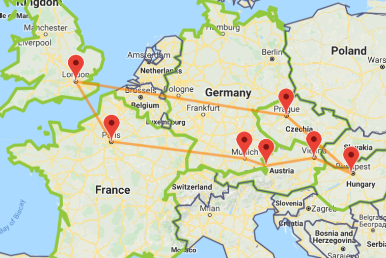

## Getting Started

Research the places you are interested in visiting and make a rough plan of what you want to get out of this experience!

We travelled to Paris, Munich, Vienna, Salzburg, Budapest and Prague. For us, immersing into the culture of the destination was very important so we budgeted accordingly and were able to do everything we had set out to!

To find out more about the possible routes you can take and to assess their feasibility, visit [this](https://www.interrail.eu/en/plan-your-trip) website for all the information you may need, from train timetables to the latest travel updates due to Covid.

Also, be sure to follow instagram pages for inspiration - here's a beautiful snapshot of Prague!



