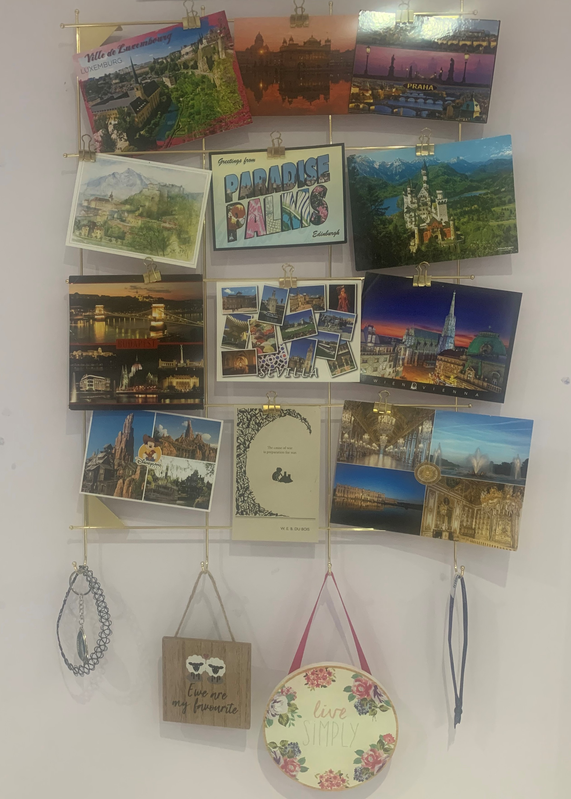

## Be Prepared

In 2018, I had the opportunity to go Interrailing with 3 other friends! What an amazing experience- I learnt alot from it! 

**My Top Tips are:**

**1.** Travel light- you will be carrying your backpack around a lot!

**2.** Book accommodation in advance.

**3.** Learn some basic words of the native language!

**4.** Budget carefully for food, accommodation, sight seeing etc. 

**5.** Check the currencies you will need and exchange beforehand.

**6.** Have a rough itinerary but don’t be too rigid with it!

**7.** Take comfortable footwear- you are easily walking 30-40 thousand steps a day!

**8.** Enjoy, relax and make the most of it!

 

